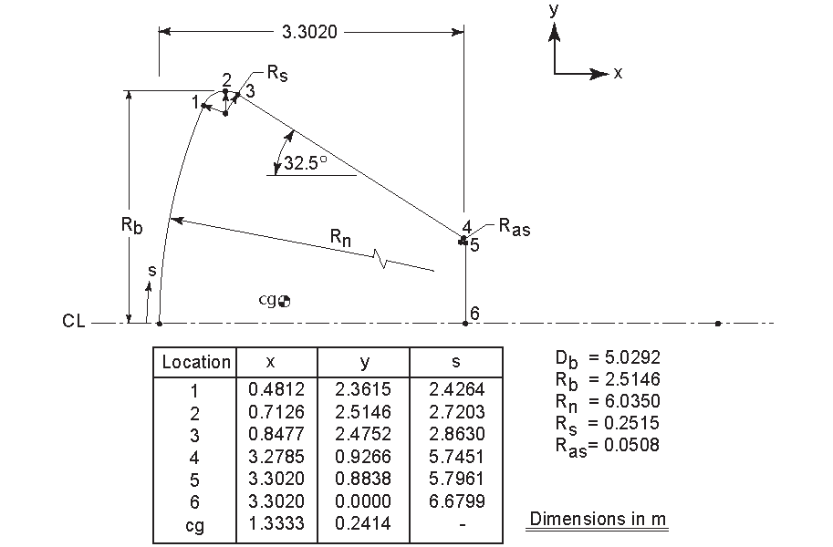

# 1. dsmcFoam+ Solver Download & Installation
This section will give you a quick guide on how to download and install the MicroNanoFlows (MNF) OpenFOAM v2.4.0 Repository which include the dsmcFoam+ solver.

Since this repository runs on the v2.4.0 of OpenFOAM foundation version, the source code package should be downloaded for the same version, using OpenFOAM foundation website from the following URL: https://openfoam.org/version/2-4-0/

The full OpenFOAM v2.4.0 installation guide can be found here: https://openfoamwiki.net/index.php/Installation/Linux/OpenFOAM-2.4.0 

Next, the MNF repository should be downloaded from the MNF GitHub page: https://github.com/MicroNanoFlows/OpenFOAM-2.4.0-MNF

Finally, the full repository installation guide is explicitly elaborated in the following URL: https://github.com/MicroNanoFlows/OpenFOAM-2.4.0-MNF/blob/master/doc/MicroNanoFlows/MNF_Repository_Install.pdf


# 2. dsmcFoam+ Case Set-up & Run for an Atmospheric Space Re-Entry Vehicle 2D Flow
## Case Set-up 
After the repository is successfully installed, in your working case directory, download the **constant/** and **system/** directories for the 2D Atmospheric Space Re-Entry of the Orion Crew Module used by NASA. Each directory contains several dictionaries and a sub-directory is found in the prior directory, that are representatives of the flow characteristics.

The **constant/** directory contains the follows dictionaries & sub-directory:
- *polyMesh* sub-directory: contains all details describing the geometry and its corresponding mesh & mesh properties for the Orion Crew Module.
- *dsmcProperties* dictionary: contains the molecular model, collisions model, energy exchange model, number of real molecules represented by 1 simulator (DSMC particle), all species properties and characteristics, and much more.

The **system/** directory contains the follows dictionaries:
- *dsmcInitialiseDict* dictionary: contains the initialization details i.e. regarding the initial state of the DSMC simulation to evolve from.
- *boundariesDict* dictionary: describes the DSMC functionality of the geometrical boundaries introduced in the *polyMesh* sub-directory.
- *fieldPropertiesDict* dictionary: holds all DSMC fields computation, for instance the the macroscopic fields of all molecular species identified.
- *controlDict* dictionary: used to set the simulation timing control information, plus data writing details and finally optional functions libraries.
- *chemReactDict* dictionary: include all types of chemical reactions occurring in the flow.
- *controllersDict* dictionary: used to have control over the the fluxes and states and it is usually left empty.
- *fvSchemes* dictionary: same as the standard CFD simulation done using OpenFOAM but here all sub-dictionaries inside this file are set as *"default no"*.
- *fvSolution* dictionary: same as the standard CFD simulation done using OpenFOAM but here all sub-dictionaries inside this file are set as *"default no"*.
- *loadBalanceDict* dictionary: includes the load balancing information feature, allowing the computation of the maximum present level of parallel computation load imbalance, in order to to ensure the distribution of DSMC particles is roughly equal between all cores. It will be left untouched, since only serial running is considered for our case.

## Atmospheric Re-Entry Flow of a 2D represantation of the Orion Crew Module
The 2D geometry of the Orion Crew Module with the relevant dimensions are presented here:


The freestream conditions used for the simulation are listed here:
| **Parameter**   | **Value**        | **Unit** |
|:----------------|:----------------:|:-------: |
| Altitude        | 105              | km       |
| Angle of Attack | -26              | degrees  |
| Velocity        | 7,600            | m/s      |
| Number Density  | 4.9759 x 10^(18) | 1/m^3    |
| Density         | 2.3004 x 10^(-7) | kg/m^3   |
| Temperature     | 211              | K        |
| Pressure        | 1.4477 x 10^(-2) | Pa       |
| Mean Free Path  | 0.3166           | m        |
| Mach Number     | 25.6             | --       |
| Kn Number       | 0.06295          | --       |

The following air composition at the specified altitude is adopted:
| **Parameter / Species**   | **N_2**          | **O_2**          | **O**            |
|:--------------------------|:----------------:|:----------------:|:----------------:|
| Mole Fraction             | 0.78187          | 0.15280          | 0.06533          |
| Number Density, 1/m^3     | 3.8905 x 10^(18) | 7.6032 x 10^(17) | 3.2508 x 10^(17) |

## Case Run
Open Ubuntu terminal/console (For Windows OS), change and select your working directory. For a brief summary of the mesh properties run the command:
```bash
checkMesh
```

Next step, is to initialize the computational domain through the domain initialization utility implemented in dsmcFoam+ solver, to do that run the command:
```bash
dsmcInitialise
```
This command will create now a **0/** directory.

Next, to run the dsmcFoam+ solver, type the command:
```bash
dsmcFoamPlus >log.dsmcFoam
```
The ```dsmcFoamPlus``` will run the dsmcFoam+ solver, and ```>log.dsmcFoam``` will write the screen output to a log-file with a *(.dsmcFOAM)* extension in the working directory. Therefore, no output is visible to the screen, this is because the simulation is launched in the background. The terminal returns to you after the simulation is finished.

To re-view the simulation progress, open a new Ubuntu terminal and type the command:
```bash
tail -f log.dsmcFoam
```
The ```-f``` flag will "follow" the output of log-file, i.e. the output on screen is refreshed once data is written to the log-file. Once the simulation is done, hit *Ctrl+C* and the terminal is returned back to you.

Finally to switch **ON** the averaging/sampling process, you have to live monitor the number of DSMC particles and the average linear kinetic energy, once these numbers exhibit a small changes with time, the averaging should begin. Hence, to plot these parameters function of the timestep, open a new Ubuntu terminal, change and select your working directory, then run the following commands:
```bash
gnuplot
load 'plotting.gnu'
```
Once steady-state is achieved, to turn on the sampling process, go to **system/fieldPropertiesDict**, search for **resetAtOutput** entry, and set it to **off** (default value is **on**) to start sampling.
